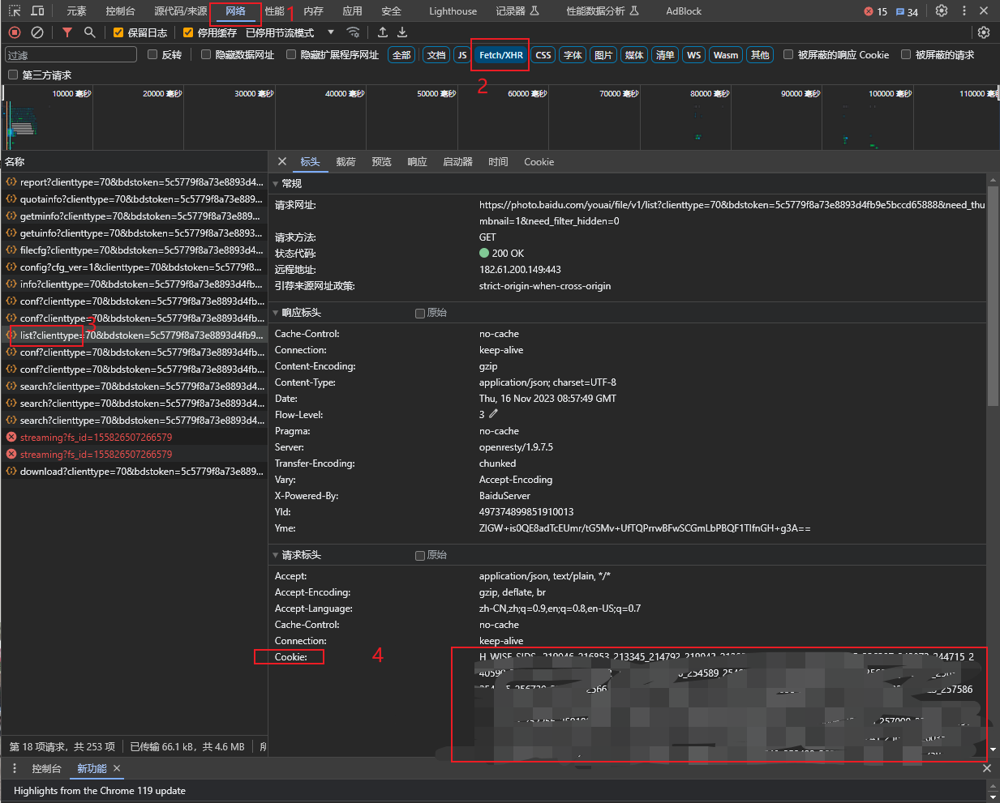
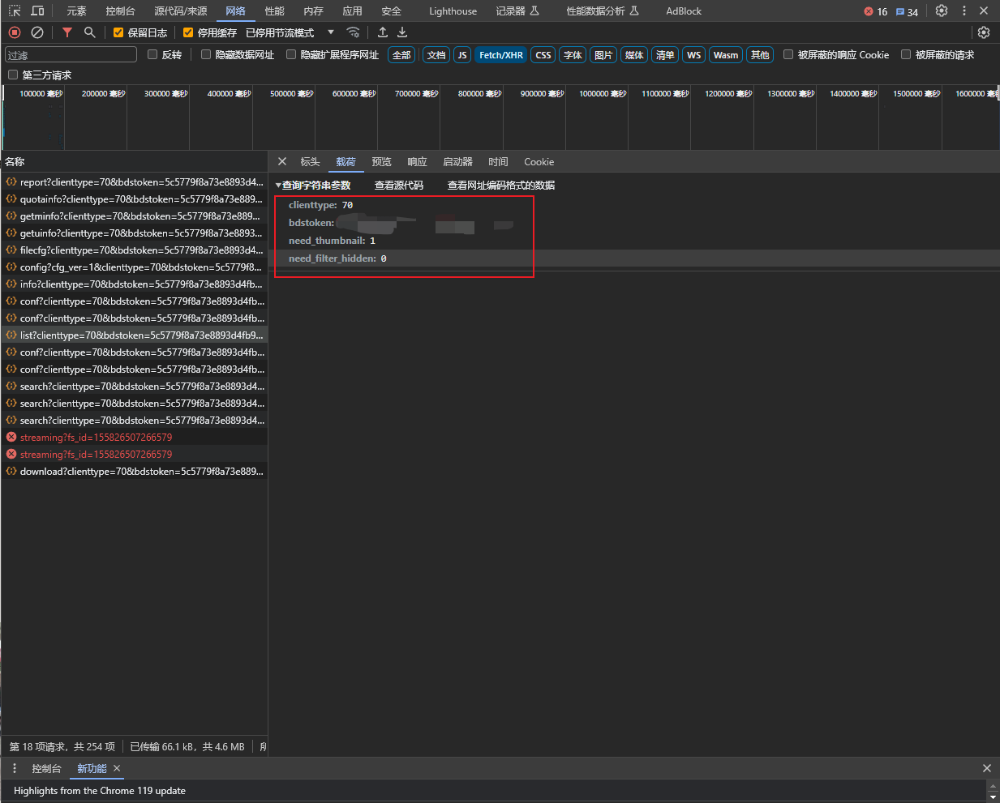

# BaiduPhoto
一键全部下载百度一刻相册中的所有图片

# 免责声明
本脚本仅仅用于快速下载一刻相册照片和视频，不得滥用以免加重百度服务器负担，不得用于窃取用户隐私，用户的一切行为与开发者无关。

# 运行环境：windows

# 使用说明
1. 在百度一刻相册浏览器端 https://photo.baidu.com/photo/web/home 按下F12
2. 按照以下流程获得Cookie
   
3. 获取表单数据
   
4. 将2、3步中找到的值填入settings.json对应位置，如果Cookie值中有双引号，则用转义字符\\"代替双引号"
5. 先运行FindPhotoList.py获得所有照片的fsid和其他信息（包括拍摄时间、地点等）
6. 再运行BaiduPhtot.py下载所有照片视频
